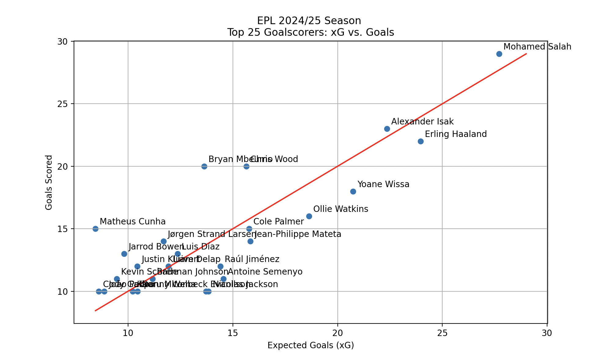
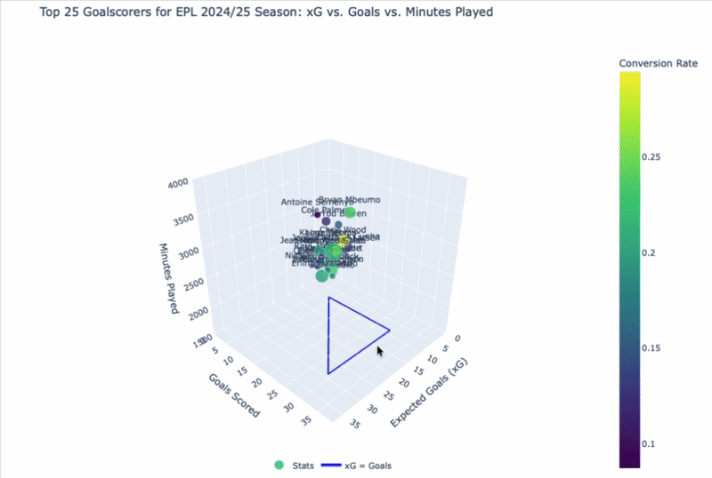

# Understat Soccer Player Performance Analysis

**Sebastian Csizmazia**

---

## Overview

This project uses the [Understat API](https://understat.com/) to pull player statistics from the top 5 European football leagues over the past 10 seasons (2014/15 through 2024/25). The analysis focuses on visualizing how efficiently and effectively players convert shot attempts into goals by comparing actual goals scored against Expected Goals (xG).

Two visualizations are produced:

1. A 2D scatter plot (matplotlib) of goals vs. xG with a reference line indicating where goals equal xG.
2. An interactive 3D scatter plot (Plotly) adding minutes played as a third axis, with marker size scaled by goals and color mapped to shot conversion rate.

---

## What is xG?

Expected Goals (xG) is a metric representing the probability that a given shot results in a goal, ranging from 0.0 to 1.0. A tap-in from close range might carry an xG of around 0.9, while a long-range effort could sit near 0.05. Comparing a player's actual goals to their cumulative xG reveals whether they are overperforming (finishing above expectation) or underperforming (missing chances the model expects to be scored).

---

## 2D Scatter Plot -- Goals vs. xG

The scatter plot below shows each player's season xG on the horizontal axis and their actual goal tally on the vertical axis. The red diagonal line marks where goals equal xG; players above the line have outperformed their expected output.

---

## Interactive 3D Plot -- Goals vs. xG vs. Minutes Played

The 3D plot adds minutes played as a depth axis, letting you rotate and explore how playing time relates to output and efficiency. Marker size reflects goal count and color encodes shot conversion rate. A blue triangle acts as a benchmark region for finishing efficiency.

---

## Configuration

The script exposes three parameters at the top of the notebook:

| Parameter | Description | Valid Values |
|-----------|-------------|--------------|
| `league` | European league to analyze | `EPL`, `La_Liga`, `Bundesliga`, `Serie_A`, `Ligue_1` |
| `season` | Season start year | `2014` through `2024` |
| `N` | Number of players to display | Any positive integer up to the league's player count (recommended 50 or fewer) |

You can also toggle between viewing the top N goalscorers and a random sample of N players by uncommenting the appropriate line.

---

## Random Sampling and the Law of Large Numbers

The notebook includes a sampling experiment that repeatedly draws random player samples, computes their average goals-to-xG ratio, and averages the results across increasing sample counts (100 to 1000). As the sample count grows, the average ratio converges toward the true population value, illustrating the Law of Large Numbers. A ratio consistently near or below 1 suggests most players perform at or below their xG on average.

---

## Findings

- On average, top goalscorers convert roughly 1 in 5 shot attempts.
- Players inside the blue triangle on the 3D plot have scored goals at or above their xG (overperformers), while those outside have scored fewer than expected (underperformers).
- Overperformance can indicate elite finishing ability, favorable luck, or temporary hot form. Underperformance may reflect missed chances, strong opposing goalkeepers, or poor form.
- Insights like these inform coaching decisions around squad selection, training focus, and player recruitment.

---

## Requirements (pip install -r requirements.txt)

- Python 3
- `understatapi`
- `pandas`# Understat Soccer Player Performance Analysis
- `plotly`
- `matplotlib`

---